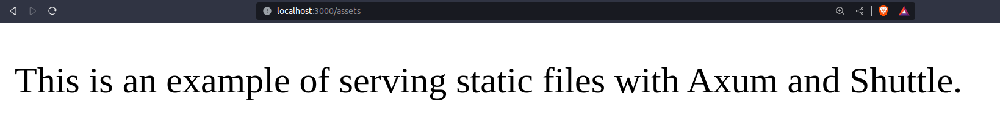

# axum_yt

### Axum project for YouTube

#### Docker (Postgres)

docker run -d -p 5432:5432 --name my-postgres -e POSTGRES_PASSWORD=mysecretpassword postgres
my-postgres is the instance name
password = mysecretpassword
user = postgres
##### To stop the container

docker stop my-postgres
#### YouTube Axum Playlist

https://www.youtube.com/playlist?list=PL38rDfx7QwKZvyMBvhfMDH6AqdGc15-bE

### AppState

The concept of "app state" in Rust web frameworks is similar to using a global variable, but it often employs a struct for several reasons that enhance maintainability, flexibility, and safety in the Rust programming language. Here's why using a struct for "app state" is beneficial:

1. **Encapsulation:**

   - A struct allows you to encapsulate related pieces of data and functionality together. This promotes a clean and organized design by grouping relevant information into a single unit.
2. **Type Safety:**

   - Rust is a statically typed language, and using a struct provides a way to define a specific type for your application state. This enhances type safety, making it clear what kind of data is stored in the state.
3. **Immutability and Borrowing:**

   - By using a struct, you can take advantage of Rust's ownership and borrowing system. You can design your struct to be immutable or mutable based on your requirements, and Rust's borrow checker ensures memory safety.
4. **Trait Implementation:**

   - The requirement for the struct to implement the `Clone` trait provides a way to create copies of the state when needed. This allows for flexibility in managing shared data without worrying about ownership complexities.
5. **Testing and Mocking:**

   - Structs make it easier to test and mock components of your application. You can create instances of the struct with specific test data, making it simpler to verify the behavior of different parts of your code.
6. **Explicitness:**

   - Using a struct makes the declaration and usage of the shared state explicit. Developers can easily understand what kind of data is part of the application state by looking at the struct definition.
7. **Modularity:**

   - The use of a struct encourages a modular design. Different components of the application can interact with the state through well-defined methods or functions, promoting separation of concerns.
8. **Extensibility:**

   - As your application evolves, using a struct allows you to easily extend the application state by adding more fields or methods to the struct.

While using a struct for "app state" in Rust web frameworks shares similarities with global variables, it introduces a level of structure and safety that aligns with Rust's principles. It helps manage the complexity of shared state in a way that is more maintainable and less error-prone than traditional global variables in other languages.

### TL,DR;

Once you have the app state, you can use it to store and manage global application-level data, such as a database connection pool, configuration settings, or other shared resources, ensuring efficient and centralized access across your Rust application.
